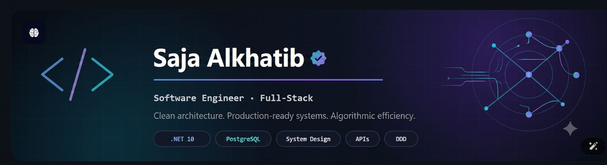

  <!-- Header -->
  

   

  <!-- Animated Tagline -->
  

    

  <!-- Social Links -->
 <!-- Profile Stats & Connect Badges -->

  

  

  

  

## 💡 About Me

I'm a Software Engineer / Full-Stack Developer focused on building reliable and maintainable web applications from end to end.

* Core Expertise: Strong foundation in .NET, C#, ASP.NET Core, Angular, databases, REST APIs, and full-stack development.
* Backend & Architecture: Interested in Clean Architecture, SOLID principles, and scalable backend systems.
* Engineering Focus: Passionate about clean code, security, testing, performance, and building production-ready applications.
* Continuous Growth: Always learning, improving my problem-solving skills, and exploring better ways to design and build software.

---
## 🛠️ Tech Stack

  

  
  
  
  
  
  

---

##  Featured Projects

### Employee Management System

**ASP.NET Core MVC · .NET 10 · Clean Architecture**

A complete Employee Management System designed with a layered Clean Architecture approach.

**Architecture**
- Domain
- Application
- Infrastructure
- Web

**Technologies**
`C#` · `.NET 10` · `ASP.NET Core MVC` · `Entity Framework Core 10` · `SQL Server` · `Bootstrap 5` · `Bootstrap Icons`

---

###  Smart Scanner

**QR Code & Barcode Scanner · Dashboard**

A smart scanning application for reading **QR codes and barcodes**, with a dashboard for viewing and managing scanned data.

**Features**
- QR Code scanning
- Barcode scanning
- Scan data management
- Interactive dashboard
- Data visualization and statistics

**Technologies**
`.NET` · `C#` · `SQL` · `HTML` · `CSS` · `JavaScript`

---

###  Hidaya Community Academy

**ASP.NET MVC · SQL Server · Bootstrap**

A full-stack web application developed for an educational academy to showcase its content and services.

**Features**
- Responsive user interface
- Dynamic academy content
- Services and information pages
- SQL Server database integration
- MVC architecture

**Technologies**
`C#` · `ASP.NET MVC` · `SQL Server` · `Bootstrap` · `JavaScript`

## 📊 GitHub Activity

  

  
  

